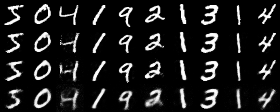

## Autoencoder with local winner-take-all mechanism

This repository implements a Autoencoder (AE) with a local winner-take-all mechanism (LWTA).

### Model design

We implement two different versions of LWTA:
- Deterministic LWTA as introduced by by [Srivastava et al.](https://papers.nips.cc/paper/5059-compete-to-compute.pdf).
- Probabilistic LWTA :
  Here, the LWTA mechanism has two different modes. During training, instead of
  deterministically deciding which unit within a
  block to retain and which to drop, the unit which is retained is decided based
  on a sample from a probability distribution defined by the softmax of the
  activations of the units within the block, and the other unit is dropped. For
  example, if the activation of one of the units is 0.5 and the activation of the
  other unit within the same block is 1.5, then the probability that it is the
  first unit which is retained is e^0.5 / (e^0.5 +e^1.5) = approximately 0.27,
  and the probability that it is the second unit which is retained is e^1.5 /
  (e^0.5 +e^1.5) = approximately 0.73. Note that exactly one unit within each
  block is dropped, and one is retained.

  As stated above, during training, we drop out units based on a sample from the
  softmax distribution. On the other hand, during testing, we don't drop any
  units, but rather we rescale their activations by the value of the softmax
  associated with that particular unit. For example, if the activation of one of
  the units is 0.5 and the activation of the other unit within the same block is
  1.5, then we multiply the activation of the first unit by e^0.5 / (e^0.5
  +e^1.5) = approximately 0.27, and the second unit by e^1.5 / (e^0.5 +e^1.5) =
  approximately 0.73.

Moreover, we compare these models with a standard AE using ReLu units in the hidden layers.
All three variants use sigmoid activation in the output layer.

The networks in this repository are fixed to have the following layer structure:
784-500-100-500-784, where each number denotes the number of units in a layer.
Thus, all three models have the same number of parameters.

We train the network on the [MNIST dataset](http://yann.lecun.com/exdb/mnist/) such that the
input and output layers have the dimension of 784 because MNIST images have size of 28 by 28, and 28\*28=784.

This figure shows the original mnist validation figures in the top row and the reconstructed figures from
all three models in the lower rows in the following order (from top to bottom): Default model without LWTA mechanism, deterministic LWTA and probabilistic LWTA. This script is produced by `create_comparison_figure.py`.

This figures shows the trajectory of the loss on the validation data for all three models and two different learning rates over 5000 steps. It is produced by `compare_learning.py`.

### Manual

The main script `script.py` has two different modes.
All options can be seen by executing
`python script.py --help`

#### Training mode

To train a model on MNIST, execute the main script with the appropriate command-line arguments.
For instance, to train the AE with deterministic LWTA with a batch size of 100 and 1000 batches in total, run
`python script.py train --layer-structure lwta --batch-size 100 --steps 1000 --model-path path/to/save/model`

#### Reconstruction mode
To use a saved model for reconstructing MNIST digits, run for example
`python script.py reconstruct --model-path path/to/model --output-path path/to/save/figure --layer-structure lwta`
You can choose a particular MNIST figure by setting the index with the optional argument `--mnist_index`.

#### Model-customized scripts

Furthermore, there are three scripts, that perform a complete training and reconstruction round of the first 10 figures of the validation dataset:

`train_default.py`
`train_LWTA.py`
`train_pLWTA.py`

### Directory structure

- `script.py`:
  Main file of the repository. See above for instructions.
- `utils.py`:
  Contains helper functions to load the MNIST data and the definition of the loss function.
- `func.py`:
  Contains the definition of the functions to train the models and use them to reconstruct.
- `network.py`:
  Contains the definitions of the different models as well as the activation functions of the
  LWTA units.
- `test.py`:
  Contains a few unit tests.
  The testsuite can be run by executing `python -m pytest test.py`.

### Requirements

This code has been written and tested using Python 3.6.3. The code requires:

Numpy (1.13.1)
Tensorflow (1.4.0)
Matplotlib (2.0.2)
Pillow (4.2.1)
